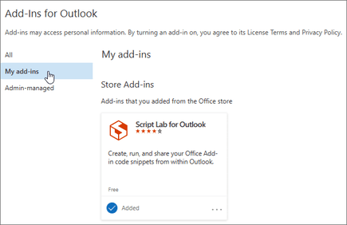
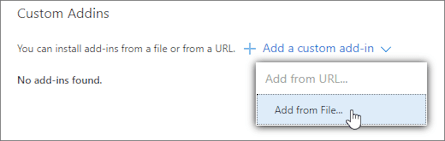

# MS Outlook tests for Windows and MacOS

A demo project with End-to-End tests with SelenideJs + WebdriverIO based Appium implementation for Windows and MacOS.

## Installation

### Pre-requisites (MacOS)

To run E2E-tests:

```bash
npm install -g appium@next \
&& appium driver install mac2 \
&& appium driver doctor mac2
```

### Pre-requisites (Windows)

To run E2E-tests:

```bash
npm install -g appium@next \
&& appium driver install --source=npm appium-windows-driver
```

### Install project dependencies

```bash
yarn install --frozen-lockfile
```

### Create certificate for development server

In parallel terminal:

```bash
npm install office-addin-dev-certs
```

## Run Tests

In parallel terminal:

```bash
appium
```

Then:

### Run tests on Windows

```bash
yarn test:e2e:windows
```

### Run tests on MacOS

```bash
yarn test:e2e:macos
```

### To inspect elements

Given, Appium Inspector installed from [official releases](https://github.com/appium/appium-inspector/releases),
And opened,
Then ensure Remote Path setting is `/` (not `/wd/hub`!),
And connect to application by starting session with the following capabilities:

#### Windows caps

```bash
    'appium:platformName': 'Windows',
    'appium:automationName': 'Windows',
    'appium:app': 'C:/Program Files/Microsoft Office/root/Office16/outlook.exe',
    'ms:waitForAppLaunch': '5',
    'ms:experimental-webdriver': true,
```

**ms:waitForAppLaunch** - if you don't include this, there is a possibility of appium not picking up the application window and throwing an error "no such window:Currently selected window has been closed".

**ms:experimental-webdriver** - required for inspecting add-ins. Add-in creates a webview, which isn't accessible by default.

**Important**
Using this capability at the moment makes impossible searching by relative xpath (`//Button` instead of `/Window/Pane/ToolBar/Pane/Pane/Pane/Pane/Pane/Group/Group/Button`) or by text. It may be fixed later, so make sure to check [docs](https://github.com/appium/appium-windows-driver?tab=readme-ov-file#readme) regularly

#### MacOS caps

```bash
    platformName: 'mac',
    'appium:automationName': 'mac2',
    'appium:bundleId': 'com.microsoft.Outlook',
```

## Add-in for MS Outlook

The `src` folder contains a custom ReactJs based add-in which can be used to add a signature to an email. Using Office.js [API](https://learn.microsoft.com/en-us/javascript/api/outlook/office.messagecompose?view=outlook-js-preview) add-in gets access to message box elements and interacts with them. This specific add-in used to add signature to the end of the letter and save letter draft.

### Start server for custom add-in

```bash
npm run start
```

This script uses `manifest.xml` file that specifies settings and capabilities of the add-in to render HTML-page on `localhost`, which can be sideloaded to your Office application. It may ask to sign in your Microsoft Account in browser, but it's not necessary for running tests, if you're signed in locally.

### Add custom add-in to application

Follow the [instruction](https://learn.microsoft.com/en-us/office/dev/add-ins/outlook/sideload-outlook-add-ins-for-testing?tabs=windows-web):

In Outlook on Windows, you can access the Add-Ins for Outlook dialog by selecting File > Info > Manage Add-ins. This opens Outlook on the web in your preferred browser, then loads the dialog.

In the Add-Ins for Outlook dialog box, select My add-ins.



Locate the Custom Addins section at the bottom of the dialog box. Select the Add a custom add-in link, and then select Add from File.



Locate the manifest file for your custom add-in and install it. Accept all prompts during the installation.

After sideloading and opening your add-in there is a possibility of popup window block appearing. As we haven't yet found a way to prevent it's appearing, for now in tests we're using a workaround - pressing Escape after opening add-in.

### Using add-in

To open add-in in the new message window find the button "Add signature" on the main tool panel and click on it. In the displayed webview you can see an input field and a button. After typing text into the input and changing focus by pressing Tab or clicking outside of it the text will be added at the end of the email text. After clicking on the button "Save message" the composed message will be saved as a draft and message window will be closed.

**Important**
Make sure ti disable auto-correction in Outlook before running tests to prevent tests failing because of it. To do so go to File > Settings > Mail, locate and click the "Editor settings" button and then "Auto-correction parameters" button. In displayed table uncheck everything and save changes.

### React properties in Appium

To get access to the add-in webview you should use driver capabilities as described [below](#windows-caps). For locating elements you can use react element properties, of which the most useful would be `id`:

```
  <Textarea
    ...
    id="signature"
  />
```

Remember that in Appium Inspector `id` would be displayed as `accessibility id`, which is the locator you should use in tests.

### Managing windows in tests

Opening new letter form creates a separate window. You can access it by using commands such as `driver.getWindowHandles()` and `driver.switchToWindow()`.

Be aware, that driver.getWindowHandles() returns an array of open application window handles, where the focused one is usually found by index `[0]`, so make sure to use `driver.getWindowHandle()` first, where there is still only one main application window and save it's value, so the handles won't be mixed up later.

Even if there is only one window left, with the others closed, still make sure to focus on this window by using `driver.switchToWindow()`, otherwise it can be unaccessible.

### User steps in tests

The app model, located in `utils/model.js` contains main user steps used to compose an email. As the user will be working in two windows for that purpose, steps are divided between `app` for operations in the main window and `message` for those in message compose window. Steps for working in add-in are also separated for better test readability.

### Auto-correction and keyboard

Make sure to disable autocorrection in your app before running tests, so it doesn't interfere with testing process.

For Windows:

- Go to File >Options > Mail and select Editor Options.
- Select Proofing > AutoCorrect Options.
- On the AutoCorrect tab, uncheck everything and save changes.

Also as there is no apparent command way to check language and switch to different keyboard layout during testing, make sure your keyboard is set to EN before running tests
